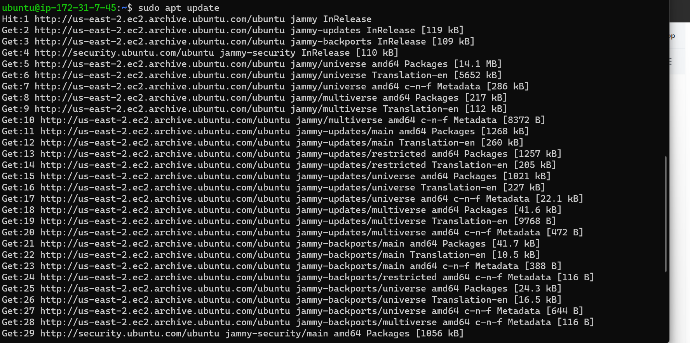
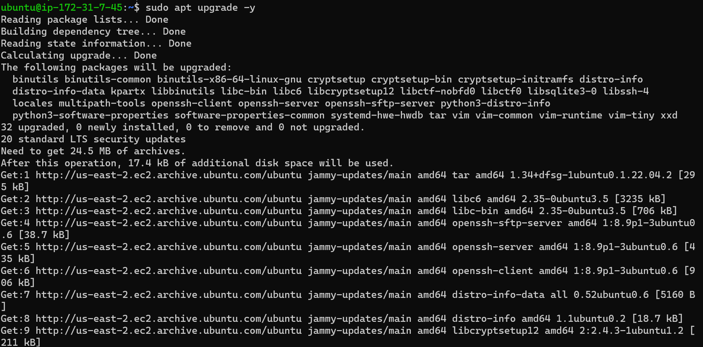

# PROJECT 3: MERN STACK IMPLEMENTATION

# Documentation of Project-3

# Simple to-do Application on MERN Web Stack

### Update Ubuntu

`sudo apt update`

### Upgrade Ubuntu

`sudo apt upgrade`

### Getting the location of Node.js software from Ubuntu Repositories

`curl -fsSL https://deb.nodesource.com/setup_18.x | sudo -E bash -`

### Installing node.js on the server

`sudo apt-get install -y nodejs`

## The command above installs both nodejs and npm.

### Verifying node and npm installation respectively

`node -v` 

`npm -v`

### Creating a new directory for to-do Project and confirming the directory

`mkdir Todo`

`ls`

### Changing Directory to Todo:

`cd Todo`

### Initializing Project by creating package.json file

`npm init`

### Running the ls command to confirm package.json file created

`ls`

### Installing ExpressJs

`npm install express`

### creating a file index.js with command:

`touch index.js`

### Running 'ls' to confirm just created file in present working directory

`ls`

### Installing the dotenv module

`npm install dotenv`

### Opening the index file

`vim index.js`

### The code below was entered and saved into the file: 

`const express = require('express');`
`require('dotenv').config();`

`const app = express();`

`const port = process.env.PORT || 5000;`

`app.use((req, res, next) => {`
`res.header("Access-Control-Allow-Origin", "\*");`
`res.header("Access-Control-Allow-Headers", "Origin, X-Requested-With, Content-Type, Accept");`
`next();`
`});`

`app.use((req, res, next) => {`
`res.send('Welcome to Express');`
`});`

`app.listen(port, () => {`
`console.log(`Server running on port ${port}`)`
`});`

### Opening terminal in the same directory as index.js file and running:

`node index.js`

### Creating an inbound rule for port 5000

Opening browser and trying to access server’s Public IP followed by port 5000:

`http://3.91.6.77:5000`

### Routes

### There are three actions that our To-Do application needs to be able to do:

 ### 1. Create a new task
 ### 2. Display list of all tasks
 ### 3. Delete a completed task

### Each task will be associated with some particular endpoint and will use different standard HTTP request methods: POST, GET, DELETE.
### For each task, we need to create routes that will define various endpoints that the To-do app will depend on. So we create a folder routes:

`mkdir routes`

### Changing directory to routes folder.

`cd routes`

### creating a file api.js with command below:

`touch api.js`

### Opening the file with:

`vim api.js`

### Code below was entered and saved:

`const express = require ('express');`
`const router = express.Router();`

`router.get('/todos', (req, res, next) => {`

`});`

`router.post('/todos', (req, res, next) => {`

`});`

`router.delete('/todos/:id', (req, res, next) => {`

`})`

`module.exports = router;`

## MODELS

### Changing directory to /Todo/ and installing Mongoose

`cd ~/Todo/`

`npm install mongoose`

### Creating new folder 'models'

`mkdir models`

### Changing directory into the newly created ‘models’ folder

`cd models`

### creating a file named todo.js inside models folder

`touch todo.js`

# All three commands above can be defined in one line to be executed consequently with help of && operator, like this:

`mkdir models && cd models && touch todo.js`
### Opening created file with `vim todo.js`, then inserting and saving the code below:

`const mongoose = require('mongoose');`
`const Schema = mongoose.Schema;`

`//create schema for todo`
`const TodoSchema = new Schema({`
`action: {`
`type: String,`
`required: [true, 'The todo text field is required']`
`}`
`})`

`//create model for todo`
`const Todo = mongoose.model('todo', TodoSchema);`

`module.exports = Todo;`

### Now we need to update routes from the file api.js in ‘routes’ directory to make use of the new model.

### Changing directory to routes

### In Routes directory, api.js will be opened with `vim api.js`, the code contained will be deleted with `:%d` command, then the code below will be entered and saved:

`const express = require ('express');`
`const router = express.Router();`
`const Todo = require('../models/todo');`

`router.get('/todos', (req, res, next) => {`

`//this will return all the data, exposing only the id and action field to the client`
`Todo.find({}, 'action')`
`.then(data => res.json(data))`
`.catch(next)`
`});`

`router.post('/todos', (req, res, next) => {`
`if(req.body.action){`
`Todo.create(req.body)`
`.then(data => res.json(data))`
`.catch(next)`
`}else {`
`res.json({`
`error: "The input field is empty"`
`})`
`}`
`});`

`router.delete('/todos/:id', (req, res, next) => {`
`Todo.findOneAndDelete({"_id": req.params.id})`
`.then(data => res.json(data))`
`.catch(next)`
`})`

`module.exports = router;`

In the index.js file, we specified process.env to access environment variables, but we have not yet created this file. So we need to do that now.
### Changing directory to Todo folder:

`cd Todo`

### Creating a file in Todo directory and naming it .env. 

`touch .env`

### Using vi editor to open and edit the .env file

`vi .env`

### Adding and saving database connection string below to the .env file:

`DB = 'mongodb+srv://<username>:<password>@<network-address>/<dbname>?retryWrites=true&w=majority'`

### Where <username>, <password>, <network-address> and <database> according to this setup

### To update the `index.js` to reflect the use of `.env` so that `Node.js` can connect to the database.

### deleting existing content in the file, and updating it with the entire code below.

`vim index.js`

`const express = require('express');`
`const bodyParser = require('body-parser');`
`const mongoose = require('mongoose');`
`const routes = require('./routes/api');`
`const path = require('path');`
`require('dotenv').config();`

`const app = express();`

`const port = process.env.PORT || 5000;`

`//connect to the database`
`mongoose.connect(process.env.DB, { useNewUrlParser: true, useUnifiedTopology: true })`
`.then(() => console.log(`Database connected successfully`))`
`.catch(err => console.log(err));`

`//since mongoose promise is depreciated, we overide it with node's promise`
`mongoose.Promise = global.Promise;`

`app.use((req, res, next) => {`
`res.header("Access-Control-Allow-Origin", "\*");`
`res.header("Access-Control-Allow-Headers", "Origin, X-Requested-With,` `Content-Type, Accept");`
`next();`
`});`

`app.use(bodyParser.json());`

`app.use('/api', routes);`

`app.use((err, req, res, next) => {`
`console.log(err);`
`next();`
`});`

`app.listen(port, () => {`
`console.log(`Server running on port ${port}`)`
`});`
### Start server using the command:

`node index.js`

### opening Postman to create a POST request to the API `http://3.91.6.77:5000/api/todos`. This request sends a new task to our To-Do list so the application could store it in the database.

### Note: we set header key Content-Type as application/json
### Post request on Postman

### Get request on Postman

### Delete request on Postman

### By now we have tested backend part of the To-Do application and have made sure that it supports all three operations wanted:

### 1. Display a list of tasks - HTTP GET request
### 2. Add a new task to the list – HTTP POST request
### 3. Delete an existing task from the list – HTTP DELETE request

### using the create-react-app command to scaffold our app, to start out with the frontend of the To-do app

`npx create-react-app client`

### Installing 'Concurrently' to run more than one command simultaneously from the same terminal window

`npm install concurrently --save-dev`

### Installing 'nodemon' to run and monitor the server. If there is any change in the server code, nodemon will restart it automatically and load the new changes.

`npm install nodemon --save-dev`

### In Todo folder we will open the package.json file, and update the file with the code below. 

`"scripts": {`
`"start": "node index.js",`
`"start-watch": "nodemon index.js",`
``"dev": "concurrently \"npm run start-watch\" \"cd client && npm start\""`
`},`

### Entering Todo folder

`cd Todo`

### Opening package.json file in Todo directory and updating the code as stated above

`vi package.json`

### Change directory to ‘client’

`cd client`

### Opening the package.json file

`vi package.json`

### Adding the key value pair in the package.json file "proxy": "http://localhost:5000"

### The purpose of adding the proxy configuration above is to make it possible to access the application directly from the browser by simply calling the server url like http://localhost:5000 rather than always including the entire path like http://localhost:5000/api/todos
### Inside the Todo directory, we run the following:

`npm run dev`

### App open and running on localhost:3000

### One of the advantages of react is that it makes use of components, which are reusable and also makes code modular. For the Todo app, there will be two stateful components and one stateless component.

### From Todo directory, we run:

`cd client`

### Then we move to the src directory

`cd src`

### Inside src folder, another folder called components is created

`mkdir components`

### Moving into the components directory:

`cd components`

### Inside ‘components’ directory three files are created namely: files Input.js, ListTodo.js and Todo.js

`touch Input.js ListTodo.js Todo.js`

### Input.js is opened using vi editor, and the following code is entered:

`vi Input.js`

`import React, { Component } from 'react';`
`import axios from 'axios';`

`class Input extends Component {`

`state = {`
`action: ""`
`}`

`addTodo = () => {`
`const task = {action: this.state.action}`

   `if(task.action && task.action.length > 0){`
      `axios.post('/api/todos', task)`
        `.then(res => {`
          `if(res.data){`
            `this.props.getTodos();`
            `this.setState({action: ""})`
          `}`
        `})`
        `.catch(err => console.log(err))`
    `}else {`
      `console.log('input field required')`
    `}`

`}`

`handleChange = (e) => {`
`this.setState({`
`action: e.target.value`
`})`
`}`

`render() {`
`let { action } = this.state;`
`return (`
`
`
`<input type="text" onChange={this.handleChange} value=``{action} />`
`<button onClick={this.addTodo}>add todo</button>`
`
`
`)`
`}`
`}`

`export default Input`

### To make use of Axios, which is a Promise based HTTP client for the browser and node.js, directory has to be changed into client 'cd into client' from the terminal and run yarn add axios or npm install axios.

`cd ~/Todo/client/src`

`cd ~/Todo/client`

### Installing Axios

`npm install axios`

## Frontend creation (contdd.)
### Changing directory into ‘components’

`cd src/components`

#### opening ListTodo (using vi editor) and inputting the following code:

`vi ListTodo.js`

`import React from 'react';`

`const ListTodo = ({ todos, deleteTodo }) => {`

`return (`
`<ul>`
`{`
`todos &&`
`todos.length > 0 ?`
`(`
`todos.map(todo => {`
`return (`
`<li key={todo._id} onClick={() => deleteTodo(todo._id)}>{todo.action}</li>`
`)`
`})`
`)`
`:`
`(`
`<li>No todo(s) left</li>`
`)`
`}`
`</ul>`
`)`
`}`

`export default ListTodo`   

#### opening ListTodo (using vi editor) and inputting the following code:

`vi Todo.js`

`import React, {Component} from 'react';`
`import axios from 'axios';`

`import Input from './Input';`
`import ListTodo from './ListTodo';`

`class Todo extends Component {`

`state = {`
`todos: []`
`}`

`componentDidMount(){`
`this.getTodos();`
`}`

`getTodos = () => {`
`axios.get('/api/todos')`
`.then(res => {`
`if(res.data){`
`this.setState({`
`todos: res.data`
`})`
`}`
`})`
`.catch(err => console.log(err))`
`}`

`deleteTodo = (id) => {`

`axios.delete(/api/todos/${id})`
      `.then(res => {`
        `if(res.data){`
          `this.getTodos()`
        `}`
      `})`
      `.catch(err => console.log(err))`

`}`

`render() {`
`let { todos } = this.state;`

   `return(`
      `
`
        `<h1>My Todo(s)</h1>`
        `<Input getTodos={this.getTodos}/>`
        `<ListTodo todos={todos} deleteTodo={this.deleteTodo}/>`
      `
`
    `)`

`}`
`}`

`export default Todo;`

### Making a little adjustment to the react code. Deleting the logo and adjust the App.js:

### Moving to the src folder

`cd ~/Todo/client/src`

### Opening App.js in the src folder to input the following code:

`vi App.js`

`import React from 'react';`

`import Todo from './components/Todo';`
`import './App.css';`

`const App = () => {`
`return (`
`
`
`<Todo />`
`
`
`);`
`}`

`export default App;`

### Still in the src directory, opening the App.css and inputting the code below:

`vi App.css`

`.App {`
`text-align: center;`
`font-size: calc(10px + 2vmin);`
`width: 60%;`
`margin-left: auto;`
`margin-right: auto;`
`}`

`input {`
`height: 40px;`
`width: 50%;`
`border: none;`
`border-bottom: 2px #101113 solid;`
`background: none;`
`font-size: 1.5rem;`
`color: #787a80;`
`}`

`input:focus {`
`outline: none;`
`}`

`button {`
`width: 25%;`
`height: 45px;`
`border: none;`
`margin-left: 10px;`
`font-size: 25px;`
`background: #101113;`
`border-radius: 5px;`
`color: #787a80;`
`cursor: pointer;`
`}`

`button:focus {`
`outline: none;`
`}`

`ul {`
`list-style: none;`
`text-align: left;`
`padding: 15px;`
`background: #171a1f;`
`border-radius: 5px;`
`}`

`li {`
`padding: 15px;`
`font-size: 1.5rem;`
`margin-bottom: 15px;`
`background: #282c34;`
`border-radius: 5px;`
`overflow-wrap: break-word;`
`cursor: pointer;`
`}`

`@media only screen and (min-width: 300px) {`
`.App {`
`width: 80%;`
`}`

`input {`
`width: 100%`
`}`

`button {`
`width: 100%;`
`margin-top: 15px;`
`margin-left: 0;`
`}`
`}`

`@media only screen and (min-width: 640px) {`
`.App {`
`width: 60%;`
`}`

`input {`
`width: 50%;`
`}`

`button {`
`width: 30%;`
`margin-left: 10px;`
`margin-top: 0;`
`}`
`}`

### opening index.css in the src direcctory and inputting code below:

`vim index.css`

`body {`
`margin: 0;`
`padding: 0;`
`font-family: -apple-system, BlinkMacSystemFont, "Segoe UI", "Roboto", "Oxygen",`
`"Ubuntu", "Cantarell", "Fira Sans", "Droid Sans", "Helvetica Neue",`
`sans-serif;`
`-webkit-font-smoothing: antialiased;`
`-moz-osx-font-smoothing: grayscale;`
`box-sizing: border-box;`
`background-color: #282c34;`
`color: #787a80;`
`}`

`code {`
`font-family: source-code-pro, Menlo, Monaco, Consolas, "Courier New",`
`monospace;`
`}`

### Returning to the Todo directory:

`cd ~/Todo`

### and running code:

`npm run dev`

### To-Do app is ready and fully functional with the functionality : creating a task, deleting a task and viewing all your tasks.

# In this Project #3, a simple To-Do app was created and deployed to MERN stack, a frontend application was wwritten using React.js that communicates with a backend application written using Expressjs. A Mongodb backend was also created for storing tasks in a database.